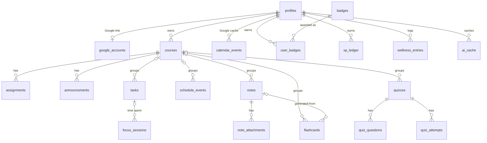
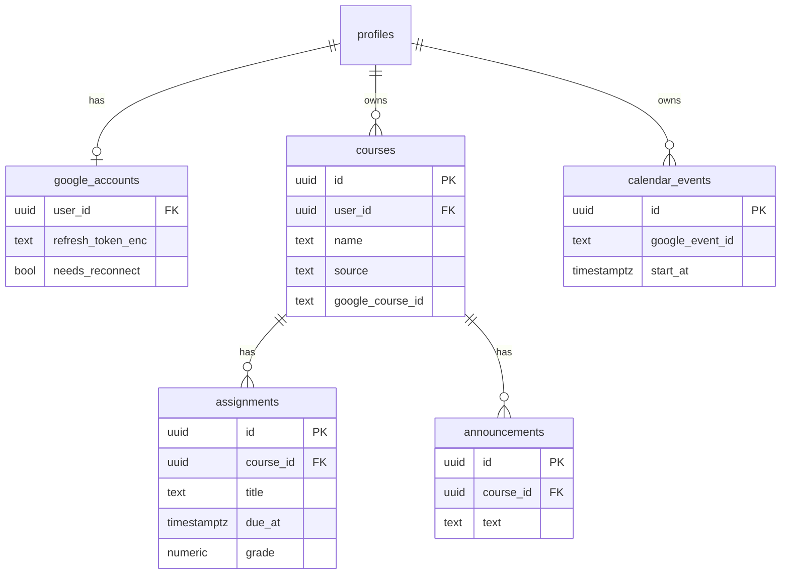
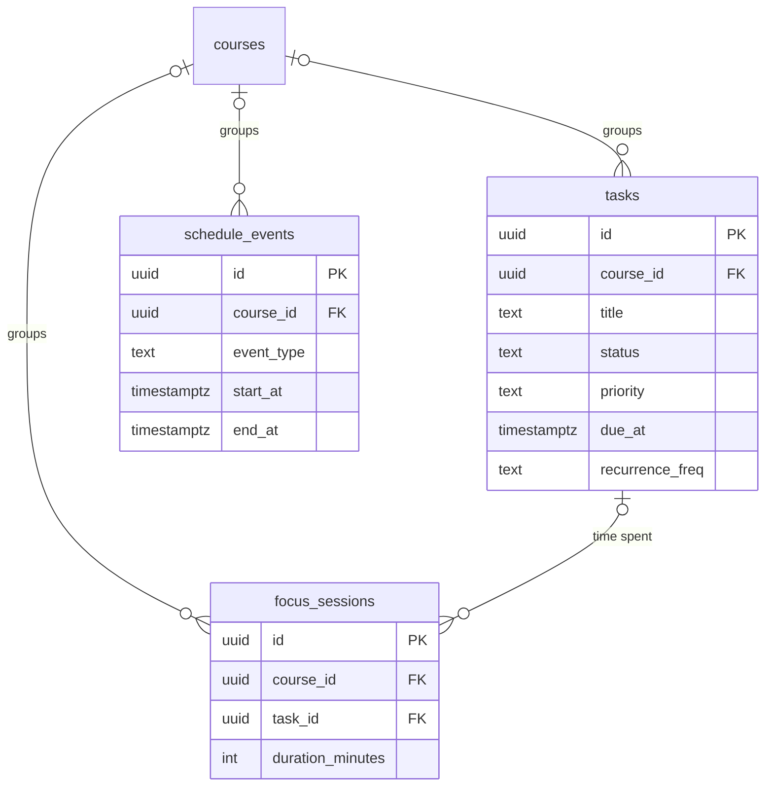
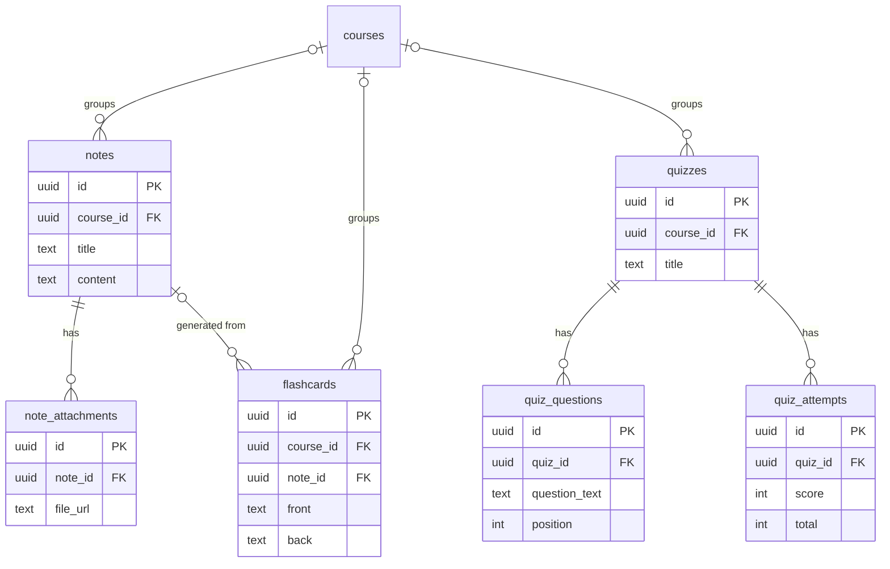
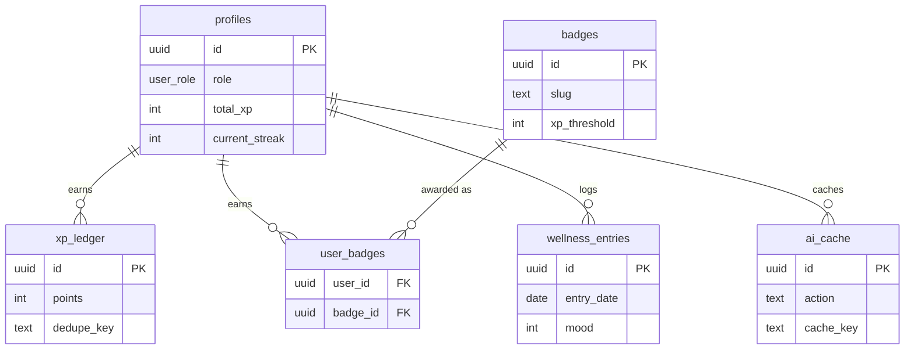

# Entity-Relationship Diagram

Mermaid ER diagrams of the `public` schema, derived from `types/database.types.ts` and `supabase/migrations/`. Column lists are trimmed to keys and a few key fields; see [data-model.md](data-model.md) for every column.

**Ownership rule (not drawn):** every table except `quiz_questions` and `badges` has `user_id → profiles.id` with owner-only RLS. `profiles.id` is itself a FK to Supabase `auth.users.id`. Dotted edges below are optional (nullable) foreign keys.

## Overview

## Courses and Google sync

## Planning

## Study Hub

## Profile, gamification and wellness

## Notes

- `academic_settings` (1:1 with `profiles`) and `courses.manual_grade` are unused leftovers, so they are omitted.
- Google-sourced rows (`courses`, `assignments`, `announcements`, `calendar_events`) carry a `google_*_id` used as the upsert key by `POST /api/dashboard/sync`.
- `xp_ledger.dedupe_key` makes XP grants idempotent (`grant_xp`, `award_*_xp`).
